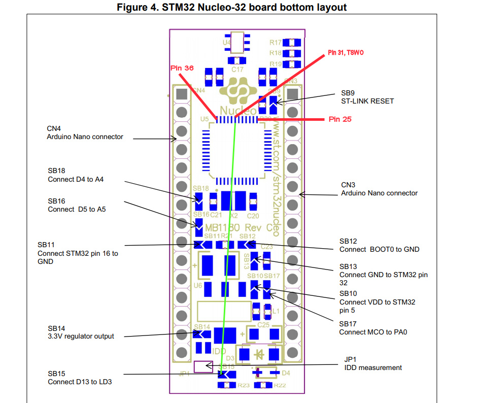
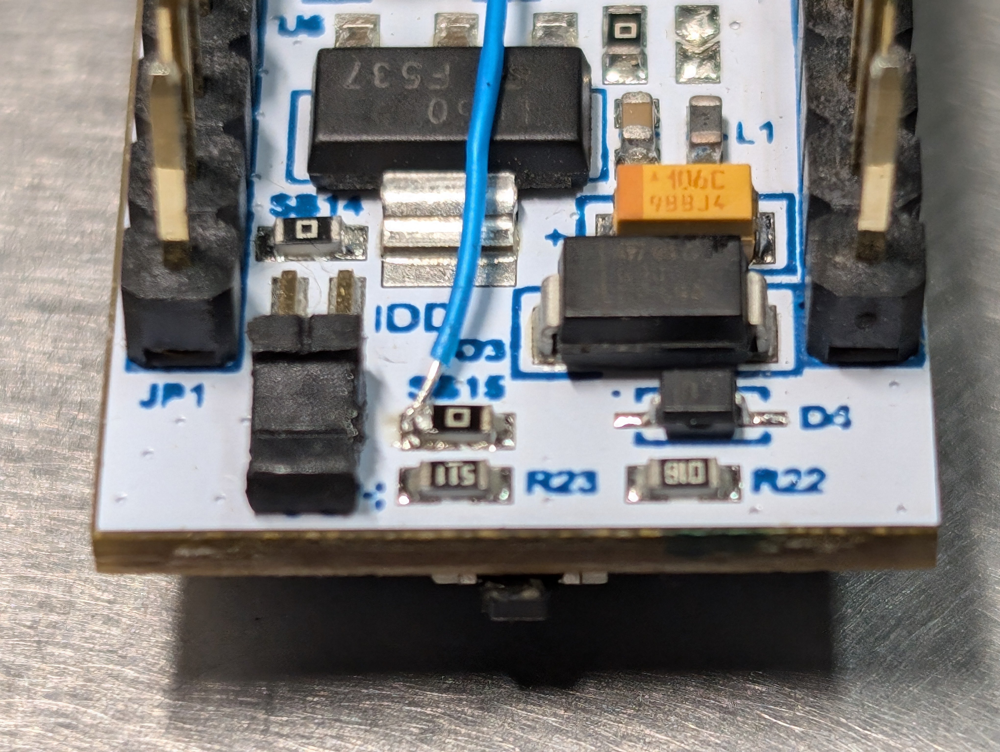
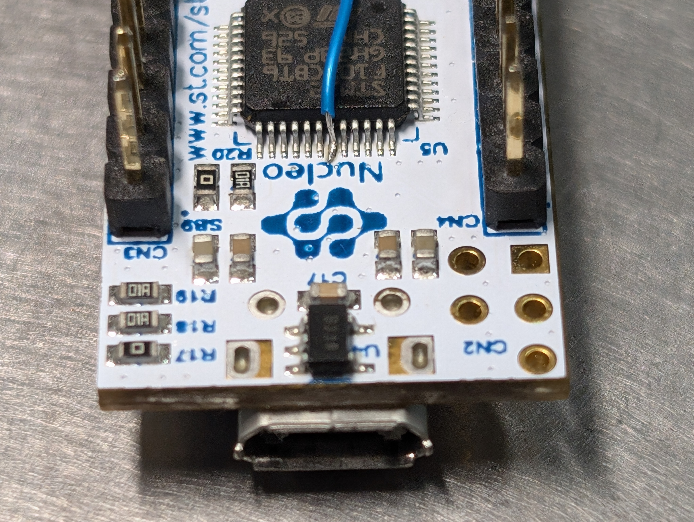
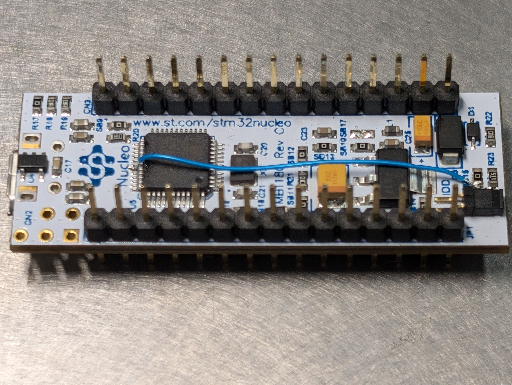

# NucleoTNC Firmware

Source code for STM32L432KC Nucleo32-based TNC (PCB & breadboard version).

http://www.mobilinkd.com/2019/06/24/nucleotnc/

# Generating STM32 Project

The framework for this project is built using STM32CubeMX using the
`NucleoTNC-Firmware.ioc` file.

The current version of this project is built using:

 - STM32CubeMX 6.12.0
 - STM32Cube L4 1.18.1 HAL
 - STM32CubeCLT 1.16.0

STM32CubeMX will generate a CMake-based build for the firmware. This is a
change from earlier versions which required using STM32CubeIDE to build the
firmware.

# Building the Firmware

By default we use STM32CubeCLT (currently version 1.16.0) for CMake, Ninja,
and the GNU utilities. But it can be built with stock CMake, Ninja and ARM GCC
from your favorite Linux distribution.

Configure the CMake build. Two common build types are "Debug" when debug
output is needed, and "RelWithDebInfo" to produce a release binary with
all debugging symbols available.

From the root directory of the repo, run:

    cmake -DCMAKE_BUILD_TYPE=Debug \
    -DCMAKE_TOOLCHAIN_FILE=cmake/gcc-arm-none-eabi.cmake \
    -S. -Bbuild/Debug -G Ninja

    cmake --build build/Debug --target NucleoTNC-Firmware --

To build the release version:

    cmake -DCMAKE_BUILD_TYPE=RelWithDbgInfo \
    -DCMAKE_TOOLCHAIN_FILE=cmake/gcc-arm-none-eabi.cmake \
    -S. -Bbuild/RelWithDebInfo -G Ninja

    cmake --build build/RelWithDebInfo --target NucleoTNC-Firmware --

# Development

I currently use Visual Studio Code on Linux, with the STM32 VS Code extension
and the CMake extension. The STM32 VS Code extension (currently version 2.1)
has some missing functionality and some unintuitive aspects. But it is better
in most respects to using STM32CubeIDE.

## Debugging

The NucleoTNC firmware, when build in Debug mode, makes use of the SWD
interface, including the SWO pin, on the STM32L432KC. However, the SWO pin
is not connected to the Nucleo32's onboard debugger. A hardware modification
is required to route the SWO pin from the STM32L432KC to an input pin on
the STM32F103 which implements the ST/Link interface. This uses the LD3
pin. The modification can be made in such a manner that either LD3 or SWO
can be used. The only limitation is that one cannot use both. Since LD3
is not used for the NucleoTNC, this is an unbotrusive modification.

Taken from the [ARM Mbed site](https://os.mbed.com/questions/80963/SWO-on-nucleo-L432KC/):

> According to the Nucleo32 user manual and schematic here the SWO pin of the target has not been connected to the receiving pin on the STLINK interface. That is why the Serial Link viewer on the PC will not show any data. You may be able to fix that if you have good soldering skills. The SWO pin of the target 432KC is PB3 (as usual). This pin is connected to D13 on the Nucleo32 board. You may want to remove SB15 and you must not use LED1 in your code as this would disable the SWO function. Connect a thin wire to either D13 or the correct side of SB15. The wire must then be connected to pin31 on the F103 processor that is on the bottom of the nucleo board. This is the tricky soldering part, but it can be done. The pin31 is just below the 'c' in the word 'nucleo' printed above the F103.

<table>
  <tr>
    <td> </td>
  </tr>
</table>

The modification only took a couple of minutes with 50mm of fine Kynar wire, solder,
some no-clean flux, and a fine soldering iron tip. It is recommended to remove the
IDD jumper while making the modification. (It must be replaced before use.)

<table>
  <tr>
    <td> </td>
    <td> </td>
    <td> </td>
  </tr>
</table>

For SWO output, you will also need to use the OpenOCD debug configuration. This
is configured in the `launch.json` file. To set this up, run `ctrl-shift-p` and
select `Debug: select and start debugging`, then select `Build and Debug Microcontroller - OpenOCD`.

With that, you will see diagnostic output in the SWO terminal when debugging
the Debug build of the firmware.

    start
    Mobilinkd NucleoTNC version 2.4.4
    CPU core clock: 48000000Hz
       Device UID: 004E005B 54365014 30303538
    Bootloader version: 0xFF
    Loading settings from EEPROM
    Setting output gain: 255 (log 1 + 4095)
    Setting input gain: 1
    readLevels: start
    dcd = 0
    dcd = 0
    exit readLevels
    Vpp = 7, Vavg = 8229
    Vmin = 8227, Vmax = 8234
    DEMODULATOR
    dcd = 0

## Boost Dependency

There is a dependency on Boost headers for the non-intrusive pointers.

There is a symbolic link from TNC/boost to /usr/include/boost. You may
need to adjust this link to build on your system. It's an expedient hack
that will need to be adjusted in the near future.

## Blaze Dependency

There is a new dependency as of 2.4.3 with the addition of the Kalman
filter.  The firmware has a dependency on the Blaze C++ math library.

There is a symbolic link from TNC/boost to /usr/include/boost. You may
need to adjust this link to build on your system. It's an expedient hack
that will need to be adjusted in the near future.

# Installing firmware

Firmware can be installed via the storage interface (drag & drop), the
on-board ST/LINK port, or via USB DFU.

**Since the addition of M17 support, the size of the firmware file is too large to be installed via the storage interface.**

## Drag & Drop

For the NucleoTNC, the easiest way to install firmware is to copy the
firmware file to the TNC directly.  The NucleoTNC will show up as a storage
device when plugged in.  Just copy the firmware.bin file into the shared
folder.  The firmware will automatically install, the NucleoTNC will reset,
and the new firmware will be running.

## ST/Link

The ST/Link port is a debug port exposed by the NucleoTNC.  It can be used
by Eclipse and other IDEs to directly upload the firmware to the TNC.

## USB DFU

 1. Download the STM32CubeProgrammer.
    https://s3.amazonaws.com/mobilinkd/en.stm32cubeprog-1.4.0.zip
    This programmer will work on Linux, OS X, and Windows.

    These days it is recommended to install STM32CubeCLT and use the programmer from that installation.

 2. Download the ELF file from the release (or that you have built from source).

 3. Run the STM32CubeProgrammer from the command-line. (Replace "firmware.elf" with the appropriate firmware filename.)

    ./STM32_Programmer_CLI -c port=USB1 -d firmware.elf -v -g 0x8000000

 4. When that is complete, the NucleoTNC will restart with the new firmware.

----

## TNC Build Instructions

Please go here: [TNC Build Instructions](https://nbviewer.jupyter.org/github/mobilinkd/NucleoTNC/blob/master/Build/NucleoTNC.ipynb)
